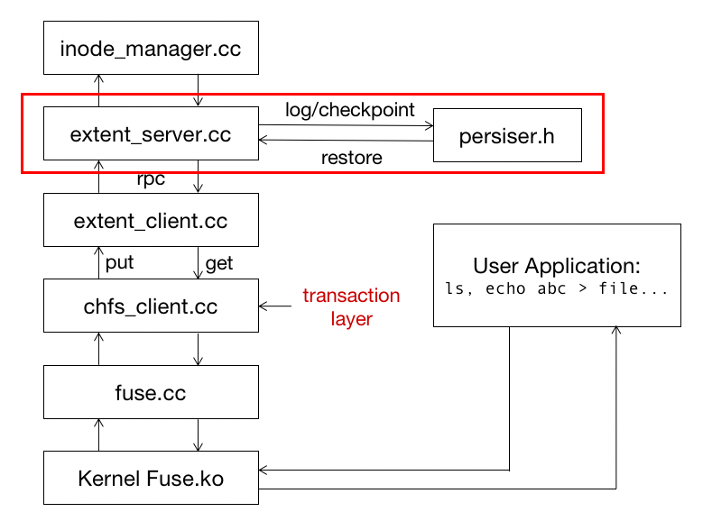

# **Lab 2A: Atomicity**

**Hand out: Oct. 20, 2022**

**Deadline: Oct. 27 23:59 (GMT+8)**

## **Introduction**

In this lab, you will learn how to achieve crash consistency in your standalone file system step by step, including:

- **Part1:** you will implement a basic persister for **data persistence**, using log mechanism to persist ChFS data into disk.
- **Part2:** you will use log mechanism to achieve **crash consistency**, i.e., each write operation(create, write, symlink…) in ChFS layer is atomic under crash condition.
- In **Part3**, you will need to implement **checkpoint** to reduce log file size.

If you have questions about this lab, either in programming environment or requirement, please ask TA **Yiwen Zhang** by email([besssszyw@gmail.com](mailto:besssszyw@gmail.com)) or Wechat.

## **Getting Started**

Please backup your solution of lab1 first.

- First, save the lab1’s solution:

  ```bash
  $ cd lab-cse
  $ git commit -a -m “solution for lab1”
  ```

- Then, pull from the repository:

  ```bash
  $ git pull
  remote: Counting objects: 43, done.
  …
  [new branch]      lab2A      -> origin/lab2A
  Already up-to-date
  ```

- Then, change to lab2 branch:

  ```bash
  $ git checkout lab2A
  ```

- Merge with lab1, and solve the conflict by yourself (probably mainly in extent_server.cc and chfs_client.cc):

  ```bash
  $ git merge lab1
  Auto-merging fuse.cc
  CONFLICT (content): Merge conflict in chfs_client.cc
  Automatic merge failed; fix conflicts and then commit the result
  ......
  ```

- After merge all of the conflicts, you should be able to compile successfully:

  ```bash
  $ make
  ```

- Make sure there's no error in make.

Note: For this lab, you will not have to worry about concurrency problems. You also need not be concerned about malicious or buggy applications.

## Transactional FileSystem

In lab1, we have implemented a basic file system on a single machine. In this lab, we will extend the file system to a transactional file system, which is robust against crashes.

Below is the architecture of our transactional filesystem in lab2A. As you see a new component named persister has been added to the system, its function is to do logging, checkpoint, and data restoration. Skeleton code of persister has been provided in file persister.h.

In our transactional filesystem, **we regard chfs_client as the transaction layer**, which means each chfs_client function(such as create, write, symlink…) should be treated as a **transaction**. Except from BEGIN and COMMIT, a transaction in ChFS usually consists of several other operations in extent_server layer. For example, the ‘create’ transaction(in chfs_client) consists of ‘create’ and ‘put’ operations(in extent_server).



- Separating persistence module from ChFS logic brings us a lot of advantages, such as better modularity, code reusability.
- Remember to persist your log and checkpoint data on disk. **And PLEASE separate your log file and checkpoint file,  put them under ‘log’ dir, name them as ‘logdata.bin’ and ‘checkpoint.bin’.**
- *You had better test your code with the previous test suit before any progress.*

## Part 1: Persistency

### **Your job**

In Part 1 your job is to use log mechanism to **persist** ChFS data into disk, and make sure data can be recovered completed after ChFS restart. The code you cope with in Part 1 is mainly in persister.h and extent_server.cc. After implementing the logging and recovering logic, your code should pass all Part 1 test scripts.

### Detailed Guidance

1. First of all, read the code and comment in persister.h carefully. In this file, we provide you with  a skeleton chfs_command class and persister class. A transaction in ChFS consists of several ChFS commands, each command corresponds to a log entry.
2. Implement chfs_command class in persister.h. A chfs_command object is a representation of a log entry, thus you may need to add transfer functions between chfs_command and string. A chfs_command object MUST contain a transaction id, other information is free to be added.
3. A chfs_command object can be used to record an extent server layer operation. In fact, there are two kinds of logs: *command log*, a redo-only log that record the parameters of the operation, so that you can redo the operation while recovering; *value log,* a redo-undo log that record the state of your system before and after the operation for undo and redo. We recommend you to implement ***value log** here*.
4. Implement function append_log and restore_logdata for persister class in persister.h. Remember to persist data into disk while logging, for crash happens anytime. And in restore_logdata, read raw binary data from disk and transfer it into ChFS command list.
5. After implementing the util tool, call logging and restoring APIs in extent_server. Make sure each operation is persisted into disk, and the data can be recovered at the next startup.

### About Test

The test in Part 1 is basic, it only crashes ChFS after a filesystem operation has done(e.g. create, write, symlink). Therefore, just focus on persistency in this part. There are 3 scripts for this part, test-lab2a-part1-a.pl, test-lab2a-part1-b.pl and test-lab2a-part1-c.sh. You can run them one by one, for example:

```bash
$ make clean && make
$ ./start.sh
starting ./chfs_client /home/stu/cse-lab/chfs1  > chfs_client1.log 2>&1 &
$ perl ./test-lab2a-part1-a.pl chfs1
create file-yyuvjztagkprvmxjnzrbczmvmfhtyxhwloulhggy-18674-0
create file-hcmaxnljdgbpirprwtuxobeforippbndpjtcxywf-18674-1
...
dircheck                                                                                                                                                 
===== ChFS Crash =====                                                                                                                                   
===== ChFS Restart =====
...
Passed all tests!
```

All three test scripts will restart ChFS for several times, each restart generates corresponding output, and follows with checks for previous filesystem operations. If test file exits without printing "Passed all tests!", then there must be something wrong with your code. If the error happens after a restart of ChFS, then check your code for logging and recovering; but if the error happens before any crash, it is probably due to your bug in lab1 code.

After passing 3 scripts one by one, run overall part 1 test scripts with:

```bash
$ make clean && make
$ ./test-lab2a-part1.sh 
starting ./chfs_client /home/stu/cse-lab/chfs1  > chfs_client1.log 2>&1 &
Passed A
Passed B
Passed C

Part1 score: 40/40
```

Now you get full score in part 1, start part 2!

## Part 2: All-or-nothing

### **Your job**

In Part 2 your job is to use log mechanism in ChFS client layer to achieve **crash consistency**, make sure each transaction(create, mkdir, write…) is atomic under crash condition.

### Detailed Guidance

Here you need to implement log logic for transaction in ChFS client. You may consider:

1. Add log API in extent server and extent client to provide log service for higher layer.
2. Call log API in ChFS client to ensure transaction atomicity.

Note that in practice, system crash may also occur when a log entry is being written to the log file. But in this lab we consider each log operation as an atomic operation, so you do not have to worry about this issue.

### About Test

The test is a little bit harder than part 1, in part 2 ChFS crashes any time, it could occur in the middle of an inode layer operation or an extent_server layer operation. In this way we can examine whether your filesystem achieves atomicity under crash conditions. There are 2 test scripts for this part, test-lab2a-part2-a.pl and test-lab2a-part2-b.pl. You can run them one by one, for example:

```bash
$ make clean && make
$ ./start.sh
starting ./chfs_client /home/stu/cse-lab/chfs1  > chfs_client1.log 2>&1 &
$ perl ./test-lab2a-part2-a.pl chfs1
create file-yyuvjztagkprvmxjnzrbczmvmfhtyxhwloulhggy-18674-0
...
===== ChFS Crash =====
test-lab2a-part2-a: cannot create chfs1/file-xerlcfysgkttqpkclweqlnsszmffexdaqwotdcfq-14912-21 due to system crash: Software caused connection abort
===== ChFS Restart =====
...
dircheck
Passed all tests!
```

All 2 test scripts will restart ChFS in the middle of filesystem operations for several times. If test file exits without printing "Passed all tests!", then there must be something wrong with your code.

After passing 2 scripts one by one, run overall part 2 test scripts with:

```bash
$ make clean && make
$ ./test-lab2a-part2.sh 
starting ./chfs_client /home/stu/cse-lab/chfs1  > chfs_client1.log 2>&1 &
Passed A
Passed B

Part1 score: 40/40
```

Now you get full score in part 2, start part 3!

## Part 3: Checkpoint

### **Your job**

In Part 3 your job is to implement **checkpoint** mechanism. Without checkpointing, log file grows indefinitely. In order to keep log file size within acceptable range, you have to use checkpoint mechanism to clear committed logs from time to time.

### Detailed Guidance

- The semantics of checkpoint in this lab is slightly different from what you learned in class. The system you learn in the class is a persistent system, every write operation is directly  write through to the disk, so a checkpoint event just clears all committed log entries. While in this lab, ChFS is a memory system, persistence is achieved through logging. Therefore, a checkpoint event not only clears the committed log entry, but also needs to persist the current state of ChFS. The data file generated by checkpoint events should be named as ‘checkpoint.bin’.
- Implement function checkpoint and restore_checkpoint for persister class in persister.h. You can either implement checkpoint by compress previous log entries, or make a snapshot of current ChFS state.
- When and how to do checkpoint is up to you, but remember to keep your log file size under **MAX_LOG_SZ**, and your checkpoint file size under **DISK_SIZE**. Also, separate your log file and checkpoint file, put them under ‘log’ dir, name them as ‘logdata.bin’ and ‘checkpoint.bin’, or your test may fail.
- Note: A *snapshot* is a record of the system state at a particular moment, it contains all the information to restore the system into the state at that moment.
- Hint: If you use snapshot in checkpoint, consider the corner case when a snapshot happens in the middle of a transaction, and the system crashes just after snapshot completed, leaving the transaction uncommitted. In this case, you may need to use value log to undo the uncommitted transaction.

### About Test

The test is fairly simple, it mainly checks the size of your log files. Log file bigger than **MAX_LOG_SZ** and checkpoint file bigger than **DISK_SIZE** will result in test failure. There are only 1 test scripts for this part, test-lab2a-part3-a.pl:

```bash
$ make clean && make
$ ./start.sh
starting ./chfs_client /home/stu/cse-lab/chfs1  > chfs_client1.log 2>&1 &
$ perl ./test-lab2a-part3-a.pl chfs1
Write and read one file: OK
...
Check directory listing: OK
===== ChFS Crash =====
Check logfile and checkpoint file size: 
        logfile xxx bytes, checkpoint xxx bytes
===== ChFS Restart =====
...
Passed all tests
```

Test script prints out your log file and checkpoint file size. If you see any error like “Logfile too big” or “Checkpoint too big”, do some optimization to control your file size.

## **GRADING**

Finally, after you've implemented all these features, run the grading script:

```bash
$ ./grade.sh
starting ./chfs_client /home/stu/cse-lab/chfs1  > chfs_client1.log 2>&1 &
Passed A
Passed B
Passed C

Part1 score: 40/40
starting ./chfs_client /home/stu/cse-lab/chfs1  > chfs_client1.log 2>&1 &
Passed A
Passed B

Part2 score: 40/40
starting ./chfs_client /home/stu/cse-lab/chfs1  > chfs_client1.log 2>&1 &
Passed A

Part3 score: 20/20
```

Note that if you encounter a **"chfs_client DIED"**, your filesystem is not working. In such cases the requests are served by the system's file system (usually EXT3 or btrfs or tmpfs). **You would not be awarded credits if your chfs_client crashes, but could get partial credit if it produces incorrect result for some test cases**. So do look out for such mistakes. **We've seen dozens of students every year thinking that they've passed lots of tests before realizing this**.

## **Handin Procedure**

After all above done:

```
$ make handin
```

That should produce a file called lab2a.tgz. Change the file name to your student id:

```
$ mv lab.tgz lab2a_[your student id].tgz
```

Then upload **lab2a_[your student id].tgz** file to [Canvas](https://oc.sjtu.edu.cn/courses/49245) before the deadline. Make sure your implementation has passed all the tests before final submit. (If you must re-submit a new version, add explicit version number such as "V2" to indicate).

You will receive full credit if your software passes the same tests we gave you when we run your software on our machines.