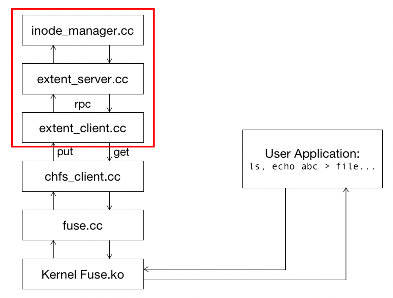
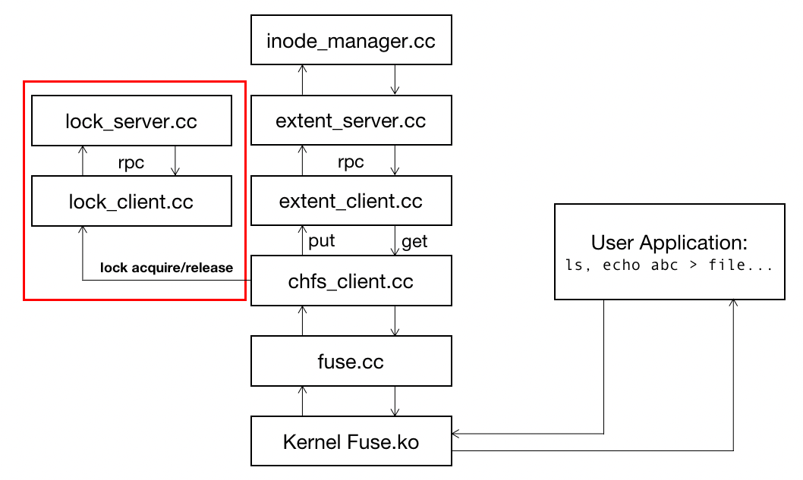

# Lab 2B: RPC and Lock Server

**Hand out: Nov. 1, 2022**

**Deadline: Nov. 10 23:59 (GMT+8)**

## Introduction

In this lab, you will learn how to achieve consistency under concurrent scenarios. This lab includes three parts:

- In **Part1**(30 points), you will use **RPC** to implement a single client file server.
- In **Part2**(20 points), you will implement a **lock server**.
- In **Part3**(50 points), you will add **2PL** to ensure that concurrent operations to the same file/directory from different chfs_clients occur one at a time.

If you have questions about this lab, either in programming environment or requirement, please ask TA **Yiwen Zhang** by email([besssszyw@gmail.com](mailto:besssszyw@gmail.com)) or Wechat.

## Getting started

Please backup your solution of lab2A first.

- First, save the lab2A’s solution:

  ```shell
  $ cd lab-cse   
  $ git commit -a -m “solution for lab2A”
  ```

- Then, pull from the repository:

  ```shell
  $ git pull   
  remote: Counting objects: 43, done.  
  …   
  [new branch]      lab2B      -> origin/lab2B   
  Already up-to-date`
  ```

- Then, change to lab2B branch:

  ```shell
  $ git checkout lab2B
  ```

- Merge with lab2A, and solve the conflict by yourself:

  ```shell
  $ git merge lab2A   
  Auto-merging fuse.cc   
  CONFLICT (content): Merge conflict in extent_client.cc   
  Automatic merge failed; fix conflicts and then commit the result   
  ......
  ```

- After merge all of the conflicts, you should be able to compile successfully:

  ```shell
  $ make
  ```

- Make sure there's no error in make.

Note: For this lab, **you will not have to worry about server failures or client failures**. You also need not be concerned about malicious or buggy applications.

## Multi-thread FileSystem

- In lab1, we have implemented a single-thread file system on a single machine. In this lab, we will extend the single-thread standalone fils system to a multi-thread standalone file system.
- Separating extent service from ChFS logic brings us a lot of advantages, such as no fate sharing with ChFS client, high availability.
- Luckily, most of your job has been done in the previous lab. You now can use extent service provided by extent_server through RPC in extent_client. Then a strawman multi-thread file system has been finished.
- *You had better test your code with the previous test suit before any progress.*

## Part 1: RPC

### Your job

In lab 2B, your aim is to extend your filesystem to a multi-thread file server. And in part 1, it now moves on to the RPC part. You will use the RPC lib(we have provided in rpc/) to achieve RPC communication between extent_server and extent_client.



### Detailed Guidance

In principle, you can implement whatever design you like as long as it satisfies the requirements in the "Your Job" section and passes the testers. In practice, you should follow the detailed guidance below.

Using the RPC system:

- The RPC library. In this lab, you don't need to care about the implementation of RPC mechanisms, rather you'll use the RPC system to make your single-thread filesystem become a multi-thread filesystem.
- A server uses the RPC library by creating an RPC server object (rpcs) listening on a port and registering various RPC handlers (see `main()` function in demo_server.cc).
- A client creates a RPC client object (rpcc), asks for it to be connected to the demo_server's address and port, and invokes RPC calls (see demo_client.cc).
- You can learn how to use the RPC system by studying the stat call implementation. Please note it's for illustration purpose only, you won't need to follow the implementation.
  - You can use `make rpcdemo` to build the RPC demo.
- RPC handlers have a standard interface with one to six request arguments and a reply value implemented as a last reference argument. The handler also returns an integer status code; the convention is to return zero for success and to return positive numbers for various errors. If the RPC fails in the RPC library (e.g.timeouts), the RPC client gets a negative return value instead. The various reasons for RPC failures in the RPC library are defined in rpc.h under rpc_const.
- The RPC system marshalls objects into a stream of bytes to transmit over the network and unmarshalls them at the other end. Beware: the RPC library does not check that the data in an arriving message have the expected type(s). If a client sends one type and the server is expecting a different type, something bad will happen. You should check that the client's RPC call function sends types that are the same as those expected by the corresponding server handler function.
- The RPC library provides marshall/unmarshall methods for standard C++ objects such as std::string, int, and char. You should be able to complete this lab with existing marshall/unmarshall methods.

### About Test

- To grade this part of lab, a overall test script

  ```bash
  $ ./grade.sh
  ```

  is provided. Here's a successful grading.

  ```shell
   $ ./grade.sh
   Passed A
   Passed B
   Passed C
   Passed D
   Passed E
   Passed G (consistency)
   Lab2 part 1 passed
   ......
  ```

- You can also run test scripts one by one:

  ```bash
  $ make clean && make
  $ ./start.sh
  starting ./chfs_client /home/stu/cse-lab/chfs1  > chfs_client1.log 2>&1 &
  $ perl ./test-lab2b-part1-a.pl chfs1
  create file-yyuvjztagkprvmxjnzrbczmvmfhtyxhwloulhggy-18674-0
  create file-hcmaxnljdgbpirprwtuxobeforippbndpjtcxywf-18674-1
  ...
  Passed all tests!
  $ ./test-lab2b-part1-g chfs1 chfs2
  Create then read: OK
  ...
  test-lab2b-part1-g: Passed all tests.
  ```

  Note test scripts a-f require only one mountpoint as input argument(use chfs1 or chfs2), test script g requires two mountpoint as input argument(use chfs1 and chfs2).

## Part 2: Lock Server

In part 2, you will implement a locking service to coordinate updates to the file system structures.



We provide you with a skeleton RPC-based lock server, a lock client interface, a sample application that uses the lock client interface, and a tester. Now compile and start up the lock server, giving it a port number on which to listen to RPC requests. You'll need to choose a port number that other programs aren't using. For example:

```bash
$ make 
$./lock_server 3772
```

Now open a second terminal on the same machine and run lock_demo, giving it the port number on which the server is listening:

```bash
$ ./lock_demo 3772
stat request from clt 1386312245
stat returned 0
```

lock_demo asks the server for the number of times a particular lock has been acquired, using the stat RPC that we have provided. In the skeleton code, this will always return 0. You can use it as an example of how to add RPCs. You don't need to fix stat to report the actual number of acquisitions of the given lock in this lab, but you may if you wish.

The lock client skeleton does not do anything yet for the acquire and release operations; similarly, the lock server does not implement lock granting or releasing. Your job is to implement this functionality in the server, and to arrange for the client to send RPCs to the server.

### Your Job

Your job is to implement a correct lock server assuming a perfect underlying network. Correctness means obeying this invariant: at any point in time, there is at most one client holding a lock with a given identifier.

### Detailed Guidance

In principle, you can implement whatever design you like as long as it satisfies the requirements in the "Your Job" section and passes the testers. In practice, you should follow the detailed guidance below.

- Using the RPC system:

  - A server uses the RPC library by creating an RPC server object (rpcs) listening on a port and registering various RPC handlers (see lock_smain.cc). A client creates a RPC client object (rpcc), asks for it to be connected to the lock_server's address and port, and invokes RPC calls (see lock_client.cc).
  - Each RPC procedure is identified by a unique procedure number. We have defined the acquire and release RPC numbers you will need in lock_protocol.h. You must register handlers for these RPCs with the RPC server object (see lock_smain.cc).
  - You can learn how to use the RPC system by studying the stat call implementation in lock_client and lock_server. RPC handlers have a standard interface with one to six request arguments and a reply value implemented as a last reference argument. The handler also returns an integer status code; the convention is to return zero for success and to return positive numbers for various errors. If the RPC fails in the RPC library (e.g.timeouts), the RPC client gets a negative return value instead. The various reasons for RPC failures in the RPC library are defined in rpc.h under rpc_const.
  - The RPC system marshalls objects into a stream of bytes to transmit over the network and unmarshalls them at the other end. Beware: the RPC library does not check that the data in an arriving message have the expected type(s). If a client sends one type and the server is expecting a different type, something bad will happen. You should check that the client's RPC call function sends types that are the same as those expected by the corresponding server handler function.
  - The RPC library provides marshall/unmarshall methods for standard C++ objects such asstd::string, int, and char. *You should be able to complete this lab with existing marshall/unmarshall methods.*

- Implementing the lock server:

  - The lock server can manage many distinct locks. Each lock is identified by an integer of type lock_protocol::lockid_t. The set of locks is open-ended: if a client asks for a lock that the server has never seen before, the server should create the lock and grant it to the client. When multiple clients request the same lock, the lock server must grant the lock to one client at a time.

  - You will need to modify the lock server skeleton implementation in files lock_server.{cc,h} to accept acquire/release RPCs from the lock client, and to keep track of the state of the locks. Here is our suggested implementation plan.

    - On the server, a lock can be in one of two states:

      - free: no clients own the client
      - locked: some client owns the lock

      The RPC handler for acquire should first check if the lock is locked, and if so, the handler should block until the lock is free. When the lock is free, acquire changes its state to locked, then returns to the client, which indicates that the client now has the lock. The valuer returned by acquire doesn't matter. The handler for release should change the lock state to free, and notify any threads that are waiting for the lock. Consider using the C++ STL (Standard Template Library) std::map class to hold the table of lock states.

    - Implementing the lock client:

      The class lock_client is a client-side interface to the lock server (found in files lock_client.{cc,h}). The interface provides acquire() and release() functions that should send and receive RPCs. Multiple threads in the client program can use the same lock_client object and request the same lock. See lock_demo.cc for an example of how an application uses the interface. lock_client::acquire must not return until it has acquired the requested lock.

    - Handling multi-thread concurrency:

      - Both lock_client and lock_server's functions will be invoked by multiple threads concurrently. On the lock server side, the RPC library keeps a thread pool and invokes the RPC handler using one of the idle threads in the pool. On the lock client side, many different threads might also call lock_client's acquire() and release() functions concurrently.
      - You should use pthread mutexes to guard uses of data that is shared among threads. You should use pthread condition variables so that the lock server acquire handler can wait for a lock. The Lab Information contain a link to information about pthreads, mutexes, and condition variables. Threads should wait on a condition variable inside a loop that checks the boolean condition on which the thread is waiting. This protects the thread from spurious wake-ups from the pthread_cond_wait() and pthread_cond_timedwait() functions.
      - Use a simple mutex scheme: a single pthreads mutex for all of lock_server. You don't really need (for example) a mutex per lock, though such a setup can be made to work. Using "coarse-granularity" mutexes will simplify your code.

### About Test

We will use the program lock_tester to check the correctness invariant, i.e. whether the server grants each lock just once at any given time, under a variety of conditions. You run lock_tester with the same arguments as lock_demo. A successful run of lock_tester (with a correct lock server) will look like this:

```bash
$ ./lock_tester 3772
simple lock client
acquire a release a acquire a release a
acquire a acquire b release b release a
test2: client 0 acquire a release a
test2: client 2 acquire a release a
...
./lock_tester: passed all tests successfully
```

If your lock server isn't correct, lock_tester will print an error message. For example, if lock_tester complains "error: server granted XXX twice", the problem is probably that lock_tester sent two simultaneous requests for the same lock, and the server granted both requests. A correct server would have granted the lock to just one client, waited for a release, and only then sent granted the lock to the second client.

## Part 3: Locking

Now in part 3, you will use the lock service to coordinate chfs clients.

You are going to ensure the atomicity of file system operations when there are multiple chfs_client processes sharing a file system. Your current implementation does not handle concurrent operations correctly. For example, your chfs_client's create method probably reads the directory's contents from the extent server, makes some changes, and stores the new contents back to the extent server. Suppose two clients issue simultaneous CREATEs for different file names in the same directory via different chfs_client processes. Both chfs_client processes might fetch the old directory contents at the same time and each might insert the newly created file for its client and write back the new directory contents. Only one of the files would be present in the directory in the end. The correct answer, however, is for both files to exist. This is one of many potential races. Others exist: concurrent CREATE and UNLINK, concurrent MKDIR and UNLINK, concurrent WRITEs, etc.

### Your Job

Your job is to add locking to chfs_client to ensure the correctness of concurrent operations.

You should eliminate ChFS races by having chfs_client use your lock server's locks. For example, a chfs_client should acquire a lock on the directory before starting a CREATE, and only release the lock after finishing the write of the new information back to the extent server. If there are concurrent operations, the locks force one of the two operations to delay until the other one has completed. All chfs_client must acquire locks from the same lock server.

### Detailed Guidance

What to lock?

- At one extreme you could have a single lock for the whole file system, so that operations never proceed in parallel. At the other extreme you could lock each entry in a directory, or each field in the attributes structure. Neither of these is a good idea! A single global lock prevents concurrency that would have been okay, for example CREATEs in different directories. Fine-grained locks have high overhead and make deadlock likely, since you often need to hold more than one fine-grained lock.
- You should associate a lock with each inumber. Use the file or directory's inum as the name of the lock (i.e. pass the inum to acquire and release). The convention should be that any chfs_client operation should acquire the lock on the file or directory it uses, perform the operation, finish updating the extent server (if the operation has side-effects), and then release the lock on the inum. Be careful to release locks even for error returns from chfs_client operations.
- You'll use your lock server from part 2. chfs_client should create and use a lock_client in the same way that it creates and uses its extent_client.
- **(Be warned! Do not use a block/offset based locking protocol! Many adopters of a block-id-as-lock ended up refactoring their code in labs later on.)**
- **(Notice: If you don't implement a reentrant lock, be careful not to recursively acquire the same lock in a thread.)**

Things to watch out for:

- This is the first lab that creates files using two different ChFS-mounted directories. If you were not careful in earlier labs, you may find that the components that assign inum for newly-created files and directories choose the same identifiers.
- If your inode manager relies on pseudo-randomness to generate unique inode number, one possible way to fix this may be to seed the random number generator differently depending on the process's pid. The provided code has already done such seeding for you in the main function of [fuse.cc](http://fuse.cc).

### About Test

The testers for this part of the lab are test-lab2-part3-a and test-lab2-part3-b, source in test-lab2-part3-a.c and test-lab2-part3-b.c. The testers take two directories as arguments, issue concurrent operations in the two directories, and check that the results are consistent with the operations executing in some sequential order. Here's a successful execution of the testers:

```bash
$ ./start.sh
$ ./test-lab2-part3-a ./chfs1 ./chfs2
Create then read: OK
Unlink: OK
Append: OK
Readdir: OK
Many sequential creates: OK
Write 20000 bytes: OK
Concurrent creates: OK
Concurrent creates of the same file: OK
Concurrent create/delete: OK
Concurrent creates, same file, same server: OK
test-lab2-part2-b: Passed all tests.
$ ./stop.sh
$ ./start.sh
$ ./test-lab2-part3-b ./chfs1 ./chfs2
Create/delete in separate directories: tests completed OK
$ ./stop.sh
```

If you try this before you add locking, it should fail at "Concurrent creates" test in test-lab2-part3-a. If it fails before "Concurrent creates", your code may have bugs despite having passed previous testers; you should fix them before adding locks.

## GRADING

Finally, after you've implemented all these features, run the grading script:

```bash
$ ./grade.sh
Passed part1 A                             
Passed part1 B                             
Passed part1 C                             
Passed part1 D                                                                        
Passed part1 E                                                                        
Passed part1 G (consistency)                                                          
lab2b part 1 passed   
Passed part2                                                                         
Concurrent creates: OK                                                                
Concurrent creates of the same file: OK                                               
Concurrent create/delete: OK               
Concurrent creates, same file, same server: OK                                        
Concurrent writes to different parts of same file: OK
Passed part3 A
Create/delete in separate directories: tests completed OK
Passed part3 B                                                                        
                                                                                      
Score: 100/100
```

## Tips

- This is also the first lab that writes null ('\0') characters to files. The std::string(char*)constructor treats '\0' as the end of the string, so if you use that constructor to hold file content or the written data, you will have trouble with this lab. Use the std::string(buf, size) constructor instead. Also, if you use C-style char[] carelessly you may run into trouble!
- Do notice that a non RPC version may pass some of the tests, but RPC is checked against in actual grading. So please refrain yourself from doing so :)

## Handin procedure

After all above done:

```
$ make handin
```

That should produce a file called lab2b.tgz. Change the file name to your student id:

```
$ mv lab.tgz lab2b_[your student id].tgz
```

Then upload **lab2b_[your student id].tgz** file to [Canvas](https://oc.sjtu.edu.cn/courses/49245) before the deadline. Make sure your implementation has passed all the tests before final submit. (If you must re-submit a new version, add explicit version number such as "V2" to indicate).

You will receive full credit if your software passes the same tests we gave you when we run your software on our machines.