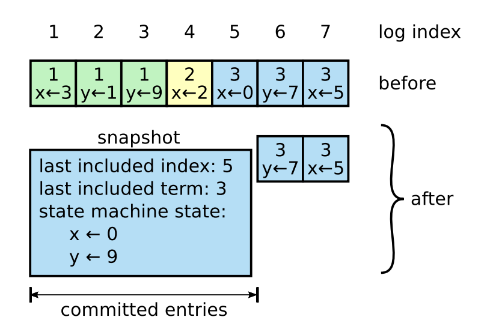

# Lab 3: Fault-tolerant Distributed Filesystem with Raft

**Due: 12-02-2022 23:59 (UTC+8)**

## Introduction

In this lab, you will design a **Raft** library to implement a fault-tolerant distributed filesystem. The library user only needs to care about implementing a single node state machine, e.g., a single node extent server. With this library, we can easily extend a single machine system to achieve high availability with strong consistency. 

Raft implements consensus by first electing a leader among the servers (part 1), then giving the leader authority and responsibility for managing the log. The leader accepts log entries from clients, replicates them on other servers, and tells servers when it is safe to apply log entries to their state machines (part 2). The logs should be persisted on the non-volatile storage to tolerate machine crashes (part 3). And as the log grows longer, Raft will compact the log via snapshotting (part 4).

There are 5 parts in this lab.
* In part 1(20 points), you will implement the leader election and heartbeat mechanism of Raft.
* In part 2(45 points), you will implement the log replication protocol of Raft.
* In part 3(20 points), you will persist Raft log.
* In part 4(5 points), you will implement the snapshot mechanism of Raft.
* In part 5(10 points), you will extend the filesystem you have implemented on lab1 to a distributed filesystem based on your Raft library.

Each part relies on the implementation of the prior one. So you must implement these parts one by one. If you have any questions about this lab, feel free to ask TA: Shuchang Liu (liushuchang0609@sjtu.edu.cn).

**Make sure you have understood Raft Algorithm talked in class [ppt](https://ipads.se.sjtu.edu.cn/courses/cse/slides/CSE-17-raft.pptx) before coding.** For more details, can refer to the [raft paper](https://raft.github.io/raft.pdf). 

**IMPORTANT**: You may take more than 12 hours to complete this lab. Start as early as possible! Hope you can enjoy the lab!

## Getting started

Before starting this lab, please back up all of your prior labs' solutions.
```
% cd cse-lab
% git commit -a -m "upload lab2B-sol"
```
Then, pull this lab from the repo:
```
% git pull
```
Next, switch to the lab3 branch:
```
% git checkout lab3
```
**Notice**: lab3 is based on **lab1** not lab2.

Please merge with branch **lab1**, and solve the conflicts.
```
% git merge lab1
```
After merging the conflicts, you should be able to compile the new project successfully:
```
$ chmod -R o+w `pwd`
$ sudo docker run -it --rm --privileged --cap-add=ALL -v `pwd`:/home/stu/cse-lab shenjiahuan/cselab_env:1.0
/bin/bash
$ cd cse-lab
$ make clean && make
```

## Overview of the code

There are 4 important C++ classes you need to pay attention to.
### `raft_command` 
Class `raft_command` in `raft_state_machine.h` is related to the state machine. When the state machines append or apply a log, the `raft_command `will be used. The state machines process identical sequences of `raft_command` from the logs, so they produce the same outputs.
```c++
class raft_command {
public:
    virtual ~raft_command();
    
    // These interfaces will be used to persistent the command.
    virtual int size() const = 0;
    virtual void serialize(char* buf, int size) const = 0;
    virtual void deserialize(const char* buf, int size) = 0;
};
```
### `raft_state_machine`
Class `raft_state_machine` in `raft_state_machine.h` represents the replicated state machines in Raft. We have already implemented `raft_command` and `raft_state_machine` for testing your Raft implementation in the first four parts. And you will implement your own in part 5. But you still need to check the interfaces provided by them in the early parts. For example, you will use the `raft_state_machine::apply_log` interface to apply a committed Raft log to the state machine.
```c++
class raft_state_machine {
public:
    virtual ~raft_state_machine();

    // Apply a log to the state machine.
    virtual void apply_log(const raft_command &cmd) = 0;

    // Generate a snapshot of the current state.
    virtual std::vector<char> snapshot() = 0;
    // Apply the snapshot to the state machine.
    virtual void apply_snapshot(const std::vector<char>&) = 0;
};
```

### `raft` 
The `raft` class (in `raft.h`) is the core of your implementation, representing a Raft node (or Raft server). `raft` is a class template with two template parameters, `state_machine` and `command`. Remember we're implementing a raft library that decouples the consensus algorithm from the replicated state machine. Therefore, the user can implement their own state machine and pass it to the Raft library via the two template parameters. 

The user ensures the `state_machine` inherits from `raft_state_machine` and the `command` inherits from `raft_command`. So you can use the interfaces provided by the two base classes in your implementation.

```c++
template<typename state_machine, typename command>
class raft {
public:
    raft(
        rpcs* rpc_server,
        std::vector<rpcc*> rpc_clients,
        int idx, 
        raft_storage<command> *storage,
        state_machine *state    
    );
    ~raft();

    // start the raft node.
    // Please make sure all of the rpc request handlers have been registered before this method.
    void start();

    // stop the raft node. 
    // Please make sure all of the background threads are joined in this method.
    // Notice: you should check whether is server should be stopped by calling is_stopped(). 
    //         Once it returns true, you should break all of your long-running loops in the background threads.
    void stop();

    // send a new command to the raft nodes.
    // This method returns true if this raft node is the leader that successfully appends the log.
    // If this node is not the leader, returns false. 
    bool new_command(command cmd, int &term, int &index);

    // returns whether this node is the leader.
    bool is_leader(int &term);

    // save a snapshot of all the applied log.
    bool save_snapshot();
}
```

### `raft_storage`
The last important class is `raft_storage`, which you will complete to persist the Raft log and metadata. `raft_storage` is also a class template with a template parameter named `command`, which is the same as the template parameter of `raft` class. And you can use the interface provided by `raft_command`, such as `size`, `deserialize` and `serialize` to implement the log persistency.

```c++
template<typename command>
class raft_storage {
public:
    raft_storage(const std::string &file_dir);
}
```

**Notice: You must not change the constructor definition of these classes.**

## Understand the `raft` class

Now, let's first walk through how `raft` works. 

Our `raft` algorithm is implemented **asynchronously**, which means the events (e.g., leader election or log replication) should all happen in the background.
For example, when the user calls `raft::new_command` to append a new command to the leader's log, the leader should return the `new_command` function immediately.
And the log should be replicated to the follower asynchronously in another background thread.

A `raft` node starts after calling `raft::start()`, and it will create 4 background threads.
```c++
template<typename state_machine, typename command>
void raft<state_machine, command>::start() {
    RAFT_LOG("start");
    this->background_election = new std::thread(&raft::run_background_election, this);
    this->background_ping = new std::thread(&raft::run_background_ping, this);
    this->background_commit = new std::thread(&raft::run_background_commit, this);
    this->background_apply = new std::thread(&raft::run_background_apply, this);
    ...
}
```

The background threads will periodically do something in the background (e.g., send heartbeats in `run_background_ping`, or start an election in `run_background_election`).
And you will implement the body of these background threads.

Besides the events, the RPCs also should be sent and handled asynchronously. If you have tried
the RPC library in lab2, you may know that the RPC call provided by the lab is a synchronous version, which means the caller thread will be blocked until the RPC completes. To implement an asynchronous RPC call, this lab also provides a thread pool to handle asynchronous events. For example:
```c++
thread_pool->addObjJob(this, &raft::your_method, arg1, arg2);
```

It is important to properly maintain the **state** of raft nodes. For example, each server stores a *current term* number. Current terms are exchanged
whenever servers communicate; if one server’s current
term is smaller than the other’s, then it updates its current
term to the larger value. If a candidate or leader discovers
that its term is out of date, it immediately reverts to follower state. The figure below shows the necessary state that should be maintained by the raft node. You can implement the raft node following the figure.
<div align=center>

</div>

## Test
### Part1-Part4
To test your implementation, you can type:
```
% ./raft_test partX
```
And you can change the `partX` to the part you want to test, e.g. `part1` to `part4`.

### Part5
To test your implementation in part5, you can type:
```
% ./test-lab3-part5.sh
```
## Part 1 - Leader Election

In this part, you will implement the **leader election** protocol and **heartbeat** mechanism of the Raft consensus algorithm. 

A server begins an election if it receives no communication over a period of time. You should implement it in `raft::run_background_election`. The process of the 
election is as follows:
  1. A follower transitions to candidate state
  2. It increments its current term
  3. It then votes for itself, and issues `raft::request_vote` RPCs in parallel to each of the other servers. A candidate continues in
     this state until one of three things happens: 
     * It receives votes from a majority of the servers and wins the election
     * Another server establishes itself as leader
     * A period of time goes by with no winner

Once a candidate wins an election, it becomes leader. It then sends heartbeat messages to all of the other servers to establish its authority and prevent new elections(`raft::run_background_ping`). 

You can implement `raft::request_vote` RPC following the rule below.
<div align=center>

</div>

You'd better follow the steps:
1. Complete the `request_vote_args` and `request_vote_reply` class in `raft_protocol.h`. Also, remember to complete the marshall and unmarshal function in `raft_protocol.cc` for RPCs.
2. Complete the method `raft::request_vote` in `raft.h` following (you may also need to define some variables for the `raft` class, such as commit_idx).
3. Complete the method `raft::handle_request_vote_reply`, which should handle the RPC reply.
4. Complete the method `raft::run_background_election`, which should turn to candidate and start an election after a leader timeout by sending request_vote RPCs asynchronously. 
5. Now, the raft nodes should be able to elect a leader automatically. But to keep its leadership, the leader should send heartbeats (i.e. an empty AppendEntries RPC) to the followers periodically. You can implement the heartbeat by implementing the AppendEntries RPC (e.g. complete `append_entries_args`, `append_entries_reply`, `raft::append_entries`, `raft::handle_append_entries_reply`, `raft::run_background_ping`,`raft::start`). You can refer to the figure in part2 to implemenmt an empty AppendEntries RPC.

You should pass the 2 test cases of this part. (10 points + 10 points)
```
% ./raft_test part1
Running 2 Tests ...
Test (part1.leader_election): Initial election
Pass (part1.leader_election). wall-time: 5.15s, user-time: 0.01s, sys-time: 0.03s
Test (part1.re_election): Election after network failure
Pass (part1.re_election). wall-time: 4.58s, user-time: 0.03s, sys-time: 0.05s
Pass 2/2 tests. wall-time: 9.73s, user-time: 0.04s, sys-time: 0.08s
```

**Hints**:
* Test:
  * You can run a single test case by its name, for example, `./raft_test part1 leader_election` will only check the `part1.leader_election` test case.
* Debug:
  * We provide a macro in `raft.h` named `RAFT_LOG`, you can use this macro to print the system log for debugging. The usage of this macro is the same as `printf`, e.g. `RAFT_LOG("Three is %d", 3);`. But it will provide additional information, such as node_id and term, in the console.
* Implementation:
  * Be careful about the election timeout, heartbeat period, and other time. To prevent split votes in the first place, election timeouts are chosen randomly from a fixed interval (e.g., 150–300ms).
  * You can send asynchronous RPC via the thread_pool. For example, to send an request_vote RPC, you can use :`thread_pool->addObjJob(this, &raft::send_request_vote, target, args);`
  * Use the big lock (e.g. use `std::unique_lock<std::mutex> lock(mtx);` at the beginning of all the events) to avoid concurrent bugs.
  * The background threads should sleep some time after each loop iteration, instead of busy-waiting the event.
  * You don't have to worry about the persistency issue until part 3.


## Part 2 - Log Replication

In this part, you will implement the `log replication` protocol of the Raft consensus algorithm. 

Once a leader has been elected, it begins servicing
client requests. Each client request contains a new command to
be executed by the replicated state machines. The leader
appends the new command to its log as a new entry(`raft::new_command`), then issues **AppendEntries** RPCs in parallel to each of the other servers to replicate the entry(`raft::run_background_commit`). Each log entry stores a state machine *command* along with the *term number* when the entry was received by the leader.

When the entry has been safely replicated, the leader applies
the entry to its state machine and returns the result of that
execution to the client(`raft::run_background_apply`). The leader decides when it is safe to apply a log entry to the state machines; such an entry is called *committed*. A log entry is committed once the leader that created the entry has replicated it on a majority of
the servers.

You can implement **AppendEntries** RPC following the rule below.
<div align=center>

</div>

Recommended steps:
1. Complete `raft::new_command` to append new command to the leader's log.
2. Complete the methods related to the AppendEntries RPC.
3. Complete `raft::run_background_commit` to send logs to the followers asynchronously.
4. Complete `raft::run_background_apply` to apply the committed logs to the state machine.

You should pass the 7 test cases of this part. (10 points + 10 points + 5 points * 5)
```
% ./raft_test part2
Running 7 Tests ...
Test (part2.basic_agree): Basic Agreement
Pass (part2.basic_agree). wall-time: 1.07s, user-time: 0s, sys-time: 0.03s
Test (part2.fail_agree): Fail Agreement
Pass (part2.fail_agree). wall-time: 3.81s, user-time: 0.01s, sys-time: 0.07s
Test (part2.fail_no_agree): Fail No Agreement
Pass (part2.fail_no_agree). wall-time: 3.54s, user-time: 0.08s, sys-time: 0.21s
Test (part2.concurrent_start): Concurrent starts
Pass (part2.concurrent_start). wall-time: 0.96s, user-time: 0.01s, sys-time: 0.03s
Test (part2.rejoin): Rejoin of partitioned leader
Pass (part2.rejoin). wall-time: 1.56s, user-time: 0.02s, sys-time: 0.16s
Test (part2.backup): Leader backs up quickly over incorrect follower logs
Pass (part2.backup). wall-time: 21.3s, user-time: 0.41s, sys-time: 1.82s
Test (part2.rpc_count): RPC counts aren't too high
Pass (part2.rpc_count). wall-time: 2.01s, user-time: 0.01s, sys-time: 0.07s
Pass 7/7 tests. wall-time: 34.26s, user-time: 0.54s, sys-time: 2.39s
```

Hints:
* Notice that the first log index is **1** instead of 0. To simplify the programming, you can append an empty log entry to the logs at the very beginning. And since the 'lastApplied' index starts from 0, the first empty log entry will never be applied to the state machine.
* Do yourself a favor for future labs (especially for lab 3 and lab 4). Make your code clean and readable.
* Remember to use the mutex!
* Don't forget to implement the marshall and unmarshall method in `raft_protocol.cc` and `raft_protocol.h` (for the template class).
* The test cases may fail due to the bug from part 1.

## Part 3 - Log Persistency

In this part, you will persist the states of a Raft node. 

Recommended steps:
1. You should implement the class `raft_storeage` in `raft_storage.h` to persist the necessary states (e.g. logs). The test case will use the constructor `raft_storage(const std::string &file_dir)` to create a `raft_storage` object. Each raft node will have its own file_dir to persist the states. And after a failure, the node will restore its storage via this dir.
2. You should use the `raft::storage` to persist the state, whenever they are changed.
3. And you should use the storage to restore the state when a Raft node is created.

You should pass the 6 test cases of this part. (5 points + 5 points + 5 points + 2 points + 2 points + 1 point)

```
% ./raft_test part3
Running 6 Tests ...
Test (part3.persist1): Basic persistence
Pass (part3.persist1). wall-time: 3.33s, user-time: 0s, sys-time: 0.03s
Test (part3.persist2): More persistence
Pass (part3.persist2). wall-time: 17.52s, user-time: 0.04s, sys-time: 0.25s
Test (part3.persist3): Partitioned leader and one follower crash, leader restarts
Pass (part3.persist3). wall-time: 2.73s, user-time: 0.03s, sys-time: 0.03s
Test (part3.figure8): Raft paper figure 8
Pass (part3.figure8). wall-time: 87.43s, user-time: 0.38s, sys-time: 1.22s
Test (part3.unreliable_agree): Agreement under unreliable network
Pass (part3.unreliable_agree). wall-time: 2.91s, user-time: 0.06s, sys-time: 0.17s
Test (part3.unreliable_figure_8): Raft paper Figure 8 under unreliable network
Pass (part3.unreliable_figure_8). wall-time: 26.15s, user-time: 0.02s, sys-time: 0.33s
Pass 6/6 tests. wall-time: 140.08s, user-time: 0.53s, sys-time: 2.03s
```

Hints:
* The test cases may fail due to the bugs from part 1 and part2.
* The network failure may cause the RPC library to print some errors, such as `rpcs::dispatch: unknown proc 3434.`. You don't need to worry about these errors since they won't cause your program to crash. 
* To simplify your implementation, you don't have to consider the crash during the disk I/O. The test case won't crash your program during the I/O. For example, you don't have to make sure the atomicity of the state persists.
* You can use multiple files to persist different data (e.g. a file for metadata and the other for logs).
* To persist the command, you can use the `serialize` and `deserialize` interface of the `raft_command`.

## Part 4 - Snapshot 

In this part, you will implement the snapshot mechanism of the Raft algorithm. 

Raft’s log grows during normal operation to incorporate more client requests, but in a practical system, it cannot grow without bound. As the log grows larger, it occupies more space and takes more time to replay. Snapshotting is the simplest approach to compaction.
In snapshotting, the entire current system state is written
to a snapshot on stable storage, then the entire log up to that point is discarded. 

<div align=center>

</div>
The figure above shows the basic idea of snapshotting in Raft. A server replaces the committed entries in its log
(indexes 1 through 5) with a new snapshot, which stores just
the current state (variables x and y in this example). 

Raft includes a small amount of metadata
in the snapshot: 
* last included index: the index of the
last entry in the log that the snapshot replaces (the last entry the state machine had applied)
* last included term: the term of this entry. 

The leader uses a new RPC called **InstallSnapshot** to
send snapshots to followers that are too far behind. When a follower receives a snapshot with this
RPC, it must decide what to do with its existing log entries. Usually the snapshot will contain new information
not already in the recipient’s log. In this case, the follower
discards its entire log. If instead, the follower receives a snapshot that describes a prefix of its log (due to retransmission or by mistake), then log entries covered by the snapshot are deleted but entries following the snapshot are still
valid and must be retained.

<div align=center>

</div>


**Notice**:
* Since snapshot is not included in class, you can refer to the raft paper (https://raft.github.io/raft.pdf) for more details.
* You don't need to partition the snapshot. You can send the whole snapshot in a single RPC.

Recommended steps:
1. Complete the classes and methods related to `raft::install_snapshot`.
2. Complete the method `raft::save_snapshot`.
3. Modify all the codes related to the log you have implemented before. (E.g. number of logs)
4. Restore the snapshot in the raft constructor.

You should pass the 3 test cases of this part. (2 points + 2 points + 1 points)
```
% ./raft_test part4
Running 3 Tests ...
Test (part4.basic_snapshot): Basic snapshot
Pass (part4.basic_snapshot). wall-time: 18.85s, user-time: 0.02s, sys-time: 0.1s
Test (part4.restore_snapshot): Restore snapshot after failure
Pass (part4.restore_snapshot). wall-time: 18.09s, user-time: 0.03s, sys-time: 0.11s
Test (part4.override_snapshot): Overrive snapshot
Pass (part4.override_snapshot). wall-time: 12.23s, user-time: 0s, sys-time: 0.07s
Pass 3/3 tests. wall-time: 49.17s, user-time: 0.05s, sys-time: 0.28s
```

Hints:
* You may skip this part and complete part 5 (which is much easier than this part) at first.
* To make the code clear, you can use two concepts for the log index: physical index (e.g. the index of the `std::vector`) and logical index (e.g. physical index + snapshot index). 
* This part may introduce many changes to your code base. So you'd better commit your codes before this part. 

## Part 5 - Fault-tolerant Filesystem

Below is the architecture of our filesystem in lab3. In this part, you will extend the filesystem you have implemented on lab1 to a filesystem that tolerates failure based on your Raft library.

<div align=center>

</div>

As you see, the single extent server has been extended to a raft group(`extent_server_dist`). The raft group replaces the `extent_server` in lab1.  `extent_server_dist` and `extent_client` will communicate using RPC lib.
**Notice: You must not change rpc interface in extent_sdist_main.cc** 
Below is the code of `extent_server_dist`. 
The raft group consists of at least three `chfs_state_machine` and provides rpc functions which will be called in `extent_client`.

```C++
class extent_server_dist {
public:
    chfs_raft_group *raft_group;
    extent_server_dist(const int num_raft_nodes = 3) {
        raft_group = new chfs_raft_group(num_raft_nodes);
    };

    chfs_raft *leader() const;

    int create(uint32_t type, extent_protocol::extentid_t &id);
    int put(extent_protocol::extentid_t id, std::string, int &);
    int get(extent_protocol::extentid_t id, std::string &);
    int getattr(extent_protocol::extentid_t id, extent_protocol::attr &);
    int remove(extent_protocol::extentid_t id,  int &);

    ~extent_server_dist();
};
```

Each `chfs_state_machine` represents an extent server. As 
you can see in the code below, the class `chfs_state_machine` has a private data member `extent_server`.
```c++
class chfs_state_machine : public raft_state_machine {
public:
    virtual ~chfs_state_machine() {
    }

    // Apply a log to the state machine.
    virtual void apply_log(raft_command &cmd) override;

    // You don't need to implement this function.
    virtual std::vector<char> snapshot() {
        return std::vector<char>();
    }

    // You don't need to implement this function.
    virtual void apply_snapshot(const std::vector<char> &) {
    }

private:
    extent_server es;
    std::mutex mtx;
}
```

You need to implement a state machine that works as a single machine extent server in `chfs_state_machine.h` and `chfs_state_machine.cc`.

Recommended steps:
1. Complete class `chfs_command_raft` in `chfs_state_machine.h` and `chfs_state_machine.cc`. 
    * The chfs_state_machines will process identical sequences of chfs_command_raft from the logs, so they can produce the same outputs. 
    * You don't need to serialize/deserialize or marshall/unmarshall the `chfs_command_raft::res` field.
2. Complete functions in `extent_server_dist.cc`. When the raft group recives the request from extent client, the leader of the group should appends the command to its log as a new entry and waits until the command is applied.
   * Notice: The command is executed asynchronously when applied to the state machine. Therefore, to get the result of the command, we provide a struct named `result` in the `chfs_command_raft`. 
   * Remember to use `loak(mtx) ` to protect the struct.
   * The usage can be like:
      ```C++
      std::unique_lock<std::mutex> lock(cmd.res->mtx);
      if (!cmd.res->done) {
          ASSERT(
              cmd.res->cv.wait_until(lock, ...) == std::cv_status::no_timeout,
              "extent_server_dist::xxx command timeout");
      }
      ```
3. Complete `chfs_state_machine::apply_log`. 
   * You should fill `result` when applying the command. The usage should be like this:
        ```c++
        std::unique_lock<std::mutex> lock(mtx); // you must use the lock to avoid contention.
        // The value of these fields should follow the definition in `chfs_state_machine.h` .
        res->done = true; // don't forget to set this
        ...
        res->cv.notify_all(); // notify the caller
        ```
    * Hint: It's convenient for you to call functions provided by `chfs_state_machine::es` to implement `apply_log`.

You should pass the 2 test cases of this part. (5 points + 5 points)
```
./test-lab3-part5.sh 
Passed basic chfs raft
Passed test chfs persist
Final score of Part5: 10 /10
```

## Grading 

After you have implmented all the parts above, run the grading script:
```
./grade.sh
```

**IMPORTANT**: The grade script will run each test case many times. Once a test case failes, you will not get the score of that case. So, please make sure there is no concurrent bugs.

## Handin Procedure

After all above done:
```
% make handin
```

That should produce a file called lab3.tgz in the directory. Change the file name to your student id:
```
% mv lab3.tgz lab3_[your student id].tgz
```
Then upload lab3_[your student id].tgz file to Canvas before the deadline.

You'll receive full credits if your code passes the same tests that we gave you, when we run your code on our machines.